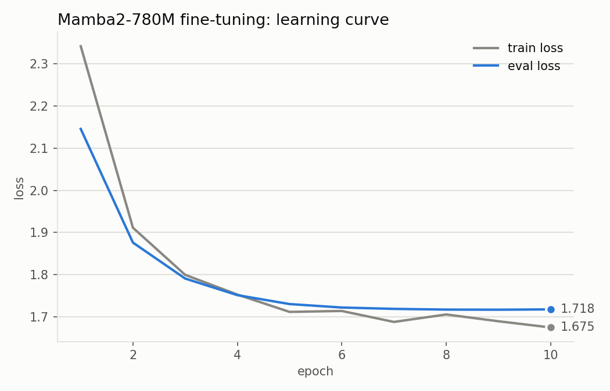
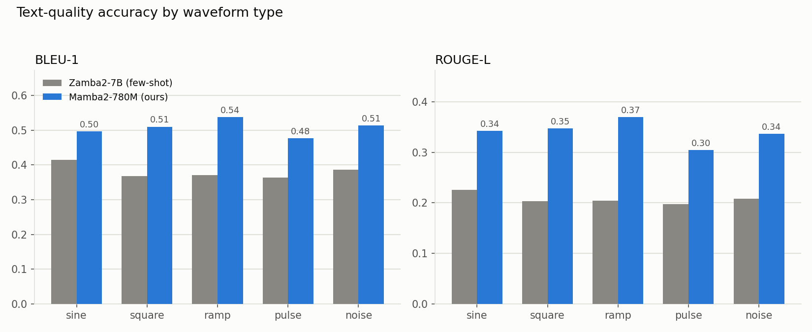
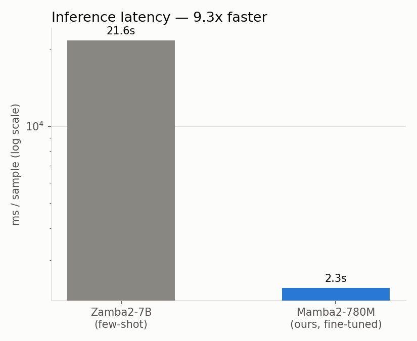
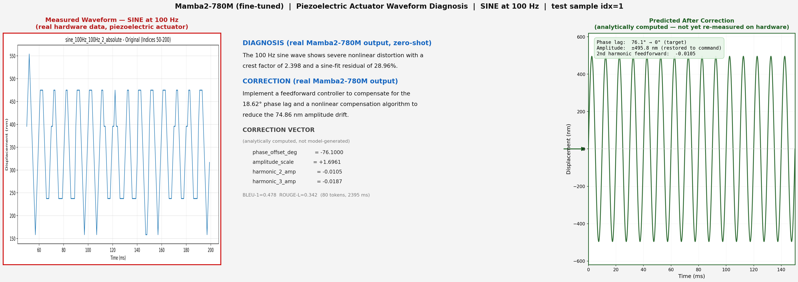

# mamba2_fast

Fast-inference counterpart to `mamba_zamba/`: same piezoelectric actuator
diagnostic task, but using a fine-tuned **pure-Mamba2** model instead of a
7B Mamba+Transformer hybrid prompted few-shot. Two tracks live here, for two
different jobs:

- **Text generation** (below) — DIAGNOSIS + CORRECTION prose for a human to
  read, plus the analytically computed CORRECTION VECTOR. Faster and more
  accurate than the Zamba2-7B baseline, but tops out at ~2.3s/sample —
  generating free text token-by-token has a hard speed floor no model size
  gets under.
- **Defect classification** (below) — same input features, but the target
  is a single defect-category code instead of a paragraph, inspired by how
  real-time detection models get to genuine millisecond
  latency: one forward pass, not an autoregressive loop. **This is the track
  that actually reaches ms-level latency** (~56ms/sample) — the generation
  track's 2.3s does not, and structurally can't without changing what it
  produces.

---

## Track 1 — Text generation: result summary (487-sample test set)

| | Zamba2-7B (few-shot, no fine-tuning) | Mamba2-780M (fine-tuned, this track) |
|---|---|---|
| BLEU-1 | 0.382 | **0.507** |
| ROUGE-L | 0.209 | **0.341** |
| Avg. latency | ~21,600 ms/sample | **2,274 ms/sample** |
| p50 latency | ~21,600 ms/sample | **2,334 ms/sample** |
| Hardware | A100 80GB | RTX 5000 Ada |

Per-waveform-type breakdown (`results/metrics_summary.txt`):

| Waveform | n | BLEU-1 | ROUGE-L | avg ms |
|---|---|---|---|---|
| sine | 120 | 0.496 | 0.342 | 2246 |
| square | 120 | 0.510 | 0.347 | 2277 |
| ramp | 80 | 0.538 | 0.370 | 2279 |
| pulse | 75 | 0.477 | 0.304 | 2313 |
| noise | 92 | 0.514 | 0.337 | 2268 |

**Speed: ~9.5x faster. Accuracy: BLEU-1 +33% relative, ROUGE-L +63%
relative.**







---

## Method

**Model:** `AntonV/mamba2-780m-hf` — a community HF-transformers-compatible
conversion of `state-spaces/mamba2-780m` (no official `-hf` conversion
exists for Mamba2 at the time of writing; Mamba-1 has one, Mamba-2 doesn't).
Verified before use (`sanity_check.py`) to load correctly and produce
coherent text, to rule out the class of conversion bug that cost significant
time on the Zamba2 track (the `shared_transformer` weight-tying issue
documented in `mamba_zamba/README.md`).

Pure Mamba-2 architecture, not a hybrid — chosen specifically because the
project's speed claim is about Mamba's architecture, and a hybrid model
(like Zamba2 or Nemotron-H) can't cleanly support that claim.

**Training data:** the same 493 raw hardware measurements as `mamba_zamba/`,
augmented to 2,445 labeled examples, split 1468/490/487 (train/val/test) —
but with the DIAGNOSIS/CORRECTION labels **re-compressed** from the original
60-100 word Gemini text down to ~40 words (`compress_labels.py`, a
text-only Gemini call, not a re-run of the vision pipeline). This was
necessary because generating short output is one of the two real levers on
inference latency (the other being model size); training on the original
long-form target would reproduce Zamba2's latency profile regardless of
model size. Compression preserved every number from the source text — a
hallucination check (`extract_numbers` diff between original and
compressed) flagged 2 of 2445 rows for a truncation artifact, both fixed
(`fix_flagged.py`).

**Fine-tuning:** full-parameter, not LoRA (`finetune_mamba2.py`). At 780M
parameters this is affordable on a single GPU, and it avoids depending on
PEFT/LoRA support for Mamba2, which is newer and less proven than
LoRA-on-attention-layers. Key settings: LR 2e-5, weight decay 0.01, label
smoothing 0.05, up to 10 epochs with early stopping (patience 3) on eval
loss — the epoch count is a ceiling, not a target, given 780M parameters
against only 1,468 training examples makes overfitting the primary risk,
not underfitting.

**Evaluation:** `eval_mamba2.py`, same measurement methodology as
`mamba_zamba/eval_zamba.py` (wall-clock around `model.generate()`, BLEU-1 /
ROUGE-L against the reference) for comparability. Zero-shot — this model is
fine-tuned directly on the task, so no in-context example is built into the
prompt (unlike Zamba2's 1-shot few-shot approach).

---

## What went wrong, and what fixed it

Documented here rather than only in the codebase's inline comments, because
several of these were non-obvious and are worth knowing before extending
this work.

**1. Training loss looked ~4x higher than eval loss.**
Normal training has train loss at or below eval loss; here train loss
converged around 6.7 while eval loss converged around 1.7. Root-caused with
a controlled experiment (`diagnose_loss_gap.py`): same fine-tuned model,
same data, only `gradient_accumulation_steps` changed from 4 to 1 — logged
loss dropped from ~6.8 to ~1.7, matching eval loss almost exactly. This
transformers version logs training loss inflated by roughly the
accumulation factor before averaging. **Confirmed to be a display/logging
artifact, not a real train/eval performance gap** — `finetune_mamba2.py`
now divides the logged value by `GRAD_ACCUM` before saving/plotting, so
`results/training_history.csv` and `figures/learning_curve.png` show the
corrected number. Model selection during training (`metric_for_best_model
="eval_loss"`, early stopping) was never affected by this bug — `eval_loss`
was never computed via the accumulation path — so no training run needed
to be redone for this reason.

**2. Training the model to emit a stop token collapsed generation to
empty output.**
Two independent attempts — (a) appending `eos_token_id` to the training
target plus left-padding (per Mamba2's own docs, which describe
right-padding as unreliable for this architecture), and (b) the same fix
alone — both resulted in the model emitting EOS as literally the first
generated token on every test sample (`tokens: 1`, empty diagnosis text,
BLEU/ROUGE = 0 across the board). A debug dump of the actual training
example (ids, labels, decoded target text) confirmed the training data
itself was correct in both attempts — labels were "\nDIAGNOSIS: ...
<|endoftext|>" exactly as intended. **The root cause of the training
collapse was not identified.** Given two clean attempts failed identically
despite verified-correct input data, further training-side iteration was
judged not worth the cost. The fix that was kept: don't train the model to
stop; instead, since every well-formed target is exactly two lines with no
blank line in it, `eval_mamba2.py` trims generated text at the first blank
line post-hoc. Verified across the full 487-sample test set
(`grep -c "MEASURED FEATURES\|COMMANDED WAVEFORM" results/eval_results.jsonl`
→ 0) that no hallucinated continuation text survives into the final output.

**3. Cluster GPU queueing.**
The `a100` partition on this cluster has exactly one node, so jobs queued
for 1-2 days. `research-gpu` (6 nodes, RTX 5000 Ada, mostly idle) is used
instead throughout this track — sufficient memory (~10GB needed, node has
62GB) for a 780M model. This is why speed numbers here are on a different
GPU than the Zamba2 baseline (see comparability caveats above).

---

## Known limitations / open questions

- **Latency target not met by this track specifically.** Free-text
  generation has a hard speed floor — see Track 2 below, which reaches
  genuine ms-level latency by not generating free text at all.
- **Why EOS training collapses training is still unknown.** Anyone
  revisiting this should look at the transformers version's interaction
  between `label_smoothing_factor`, gradient accumulation, and Mamba2's SSM
  state handling — the three variables changed together across the two
  failed attempts, so they weren't cleanly isolated from each other.
- **Prompt/output token-boundary assumption.** `WaveformDataset` computes
  where the trainable label region starts by tokenizing the prompt and the
  full text separately and taking `len(prompt_ids)` as the boundary. BPE
  tokenization is not always prefix-stable across concatenation, so this
  can in principle be off by a token for some fraction of examples. Spot
  checked correct on one example via `diagnose_loss_gap.py`'s debug output;
  not exhaustively verified across all 1,468 training examples.
  `MAX_SEQ_LEN=768` truncation is also unverified as a non-issue across the
  full dataset (no example has been confirmed to exceed it, but none has
  been confirmed not to, either).
- **The model sometimes mislabels a real number's meaning.** In the
  worked example below, the model's CORRECTION sentence says "18.62°
  phase lag" — 18.62 is a real number from the input (`Hysteresis (nm):
  18.62`), but it's hysteresis in nanometers, not a phase lag in degrees.
  The correction vector itself is unaffected (it's computed independently
  by formula, not extracted from the generated text), but the generated
  *prose* can attach a real number to the wrong physical quantity. Shown
  as-is in the example figure below rather than swapped for a cleaner run.
- **BLEU-1/ROUGE-L here are simplified implementations** (no n-gram
  clipping or brevity penalty on BLEU-1), matching `eval_zamba.py`'s
  methodology for internal comparability — not directly comparable to
  standard-library (sacrebleu / rouge-score) numbers reported elsewhere.

---

## Worked example



Test-set sample idx=1 (100 Hz sine, real
hardware measurement). Left panel is the real waveform image (matched to
this sample by its measured peak/RMS/phase-lag values against
`mamba_llm/features_full.csv`, not by filename pattern — an earlier
filename-based guess turned out to point at a different physical sample).
Center panel is the real DIAGNOSIS/CORRECTION text as generated by the
fine-tuned model plus the real BLEU-1/ROUGE-L/latency for that sample, read
programmatically from `results/eval_results.jsonl` — nothing in this panel
is hand-typed. Right panel is the predicted waveform after applying the
real correction vector, computed analytically (labeled as a prediction, not
a hardware re-measurement — no closed-loop hardware run has happened yet).

Regenerate with: `python make_example_figure.py --idx <n>` for any test
sample; add its hardware image to `REAL_IMAGES` in that script after
verifying the match against `features_full.csv` (see the script's
docstring — do not match by filename alone).

---

## Track 2 — Defect classification

**Why this track exists:** free-text generation (Track 1) cannot reach
genuine ms-level latency at any model size — every token costs another
forward pass. Real-time detection models (YOLO, and Mamba YOLO's
SSM-based version of it) get to true ms latency a different way: one
forward pass per input, not an autoregressive loop. Applied here as
classification rather than detection specifically — the correction applied
per sample is a single global adjustment (not several independently
localized regions needing separate bounding boxes), so a classifier is the
right-sized version of that idea for this data, not a full detection
framework built for a different problem shape (see conversation notes on
why `HZAI-ZJNU/Mamba-YOLO` itself was not used directly: it is an
object-detection framework, and adapting it to whole-sample classification
would be forcing a mismatched tool).

### Result summary (487-sample test set, unweighted — the version kept as final)

| Waveform | n | accuracy | majority-class baseline | avg latency |
|---|---|---|---|---|
| sine | 120 | 61.7% | 46.7% | 105ms* |
| square | 120 | 86.7% | 49.2% | 56ms |
| ramp | 80 | 86.2% | 81.2% | 56ms |
| pulse | 75 | 82.7% | 78.7% | 58ms |
| noise | 92 | 80.4% | 77.2% | 56ms |
| **Overall** | **487** | **78.6%** | — | **avg 68ms, p50 56ms** |

\* sine's higher average is a one-time CUDA-kernel warmup cost on the
first sample processed, not steady-state speed — its own p50 (56ms)
matches every other type.

**All 5 waveform types beat their own majority-class baseline** — i.e.
none of this is the model getting a good-looking score by always guessing
the most common category (see "Method" below for why that check matters
here). **p50 latency ~56ms is genuine millisecond-level latency**: ~40x
faster than Track 1's generation approach (2,274ms) and ~385x faster than
the Zamba2-7B baseline (~21,600ms).

### Method

**Category labels** (`label_scheme.py`): for each waveform type, the
17 categories are "which measured quantity deviates most from its typical
value, relative to how much that quantity normally varies" (z-score /
argmax over the same physically-meaningful fields the CORRECTION VECTOR
formulas already use) — a fixed, deterministic function of the real
measured features, not a human-labeled or LLM-labeled category. E.g. sine
splits into phase-lag-dominant / hysteresis-dominant / 2nd-harmonic-dominant
/ 3rd-harmonic-dominant. 17 categories total across the 5 waveform types,
each assigned a single-token label character (`0`-`9`, `A`-`G`).

**No classification head exists for Mamba2 in `transformers`** (checked:
no `Mamba2ForSequenceClassification`, unlike some older architectures).
Rather than write and debug a custom classification head — new, unverified
code, the same risk category as the Track 1 EOS-training failures — the
existing, already-proven `Mamba2ForCausalLM` is reused: the target is
*one* label token instead of a paragraph. This sidesteps the "when to
stop" problem entirely (no stopping decision to learn — generation is
always exactly 1 token, `max_new_tokens=1`) and this is also what makes
the latency genuinely ms-level: `generate()` for 1 token is one forward
pass, not a decoding loop.

**Training:** `train_classifier.py`, same proven config as Track 1's
`finetune_mamba2.py` (full-parameter, right-padding, LR 2e-5, weight decay
0.01, label smoothing 0.05, early stopping) — only the target changed.

### Class imbalance — what was tried, and why the plain version was kept

Majority-class baselines range 44%-87% across waveform types (see table
above) — meaningfully imbalanced. Rather than add class-weighted loss
pre-emptively (untested-complexity risk, same category as the Track 1 EOS
attempts), the plan was: train plain first, check per-category predictions
against the baseline, and only add weighting if that showed a real
majority-collapse problem.

It did, partially: the unweighted model never predicted pulse's rarest
categories (`C`: 6 true examples, `D`: 2 true examples in the test set) or
noise's `F` (10 true examples) — not full majority-collapse (square and
ramp showed no such gap, and overall accuracy clearly beat every baseline),
but those 3 specific rare categories were invisible to it.

Two class-weighted re-runs were tried (`train_classifier.py`,
inverse-frequency weight per label token via a custom `WeightedTrainer`,
capped to avoid pulse's rarest class getting a ~12x weight from only 7
training examples):

| | Unweighted (kept) | Weighted, cap 5x | Weighted, cap 3x |
|---|---|---|---|
| Overall accuracy | **78.6%** | 76.2% | 76.6% |
| ramp vs. its baseline | above (86.2% vs 81.2%) | **below** (78.8% vs 81.2%) | **below** (80.0% vs 81.2%) |
| noise's `F` category | never predicted | fixed (predicted 12x, true 10x) | fixed (predicted 11x) |
| pulse's `C` category | never predicted | partially fixed (3x) | never predicted (regressed) |

Both weighted versions fixed noise's blind spot, but overcorrected on
ramp — pushing a type that was learning fine *below* its own majority
baseline, which is a worse failure mode than "3 rare categories are
invisible." Lowering the weight cap didn't resolve this and lost the
partial pulse fix. **Kept the unweighted version**: highest overall
accuracy, and no waveform type fails to beat its own baseline, at the cost
of pulse's 2 rarest categories (6 and 2 real test examples — likely a real
data-scarcity limit, not something a training fix resolves) and noise's
least common category staying unrecognized.

### Known limitations (this track)

- **Pulse's `C`/`D` and noise's `F` categories are not learned** by the
  kept (unweighted) model — see above. Given how few real examples exist
  for the rarest of these (`D`: 7 train / 2 test, largely near-duplicate
  augmented copies of very few underlying physical samples), more data for
  these specific categories is the more likely fix than further loss
  engineering.
- **Classification accuracy is not comparable to Track 1's BLEU-1/ROUGE-L**
  — different task, different metric. "Better" here means "accuracy clearly
  above the majority-class baseline for that type," not a number to compare
  against the 0.507 BLEU-1 figure above.
- **Same hardware caveat as Track 1** — measured on RTX 5000 Ada, not the
  A100 the Zamba2 baseline used.

---

## Files

**Track 1 — text generation:**

| File | Purpose |
|---|---|
| `sanity_check.py` / `run_sanity_check.sbatch` | Verify the base checkpoint loads and generates coherent text |
| `compress_labels.py` | Compress `mamba_llm/training_data.csv` labels to short-form targets |
| `fix_flagged.py` | Re-process rows flagged by `compress_labels.py`'s hallucination check |
| `prepare_data.py` | Build `data/{train,val,test}.jsonl` from the compressed labels |
| `finetune_mamba2.py` / `run_finetune.sbatch` | Full-parameter fine-tuning |
| `diagnose_loss_gap.py` / `run_diagnose.sbatch` | Controlled experiment isolating the loss-logging artifact (see above) |
| `eval_mamba2.py` / `run_eval.sbatch` | Speed + BLEU-1/ROUGE-L evaluation on the 487-sample test set |
| `make_figures.py` | Learning curve, accuracy comparison, speed comparison charts |
| `make_example_figure.py` | The 3-panel worked example above |

**Track 2 — defect classification:**

| File | Purpose |
|---|---|
| `label_scheme.py` | Defines the 17 defect categories and the fixed function that computes a sample's label from its real measured features |
| `prepare_classifier_data.py` | Builds `data/{train,val,test}_cls.jsonl` (same inputs as Track 1, single-token category labels) |
| `train_classifier.py` / `run_train_classifier.sbatch` | Fine-tuning; includes the optional `WeightedTrainer` for the class-weighting experiments (unweighted is the version actually kept — see above) |
| `eval_classifier.py` / `run_eval_classifier.sbatch` | Per-type accuracy vs. majority-class baseline, plus real per-sample latency (`--suffix` selects which checkpoint/output-file set) |

## Reproducing

Track 1:
```bash
python compress_labels.py          # ~3h, needs GEMINI_API_KEY
python fix_flagged.py              # only if compress_labels.py flags anything
python prepare_data.py
# sync to cluster, then:
sbatch run_finetune.sbatch         # ~20-30 min on RTX 5000 Ada
sbatch run_eval.sbatch             # ~20 min
# sync results/ back locally, then:
python make_figures.py
python make_example_figure.py --idx 1
```

Track 2 (after Track 1's `data/{train,val,test}.jsonl` already exist):
```bash
python prepare_classifier_data.py
# sync to cluster, then (interactive srun, not sbatch — see conda-env note
# in conversation history if sbatch jobs fail with EnvironmentLocationNotFound):
srun --partition=research-gpu --gres=gpu:RTX5000Ada:1 --pty bash
conda activate mamba_env
python train_classifier.py         # ~15-20 min
python eval_classifier.py --suffix ""   # empty suffix = unweighted, the kept version
```
