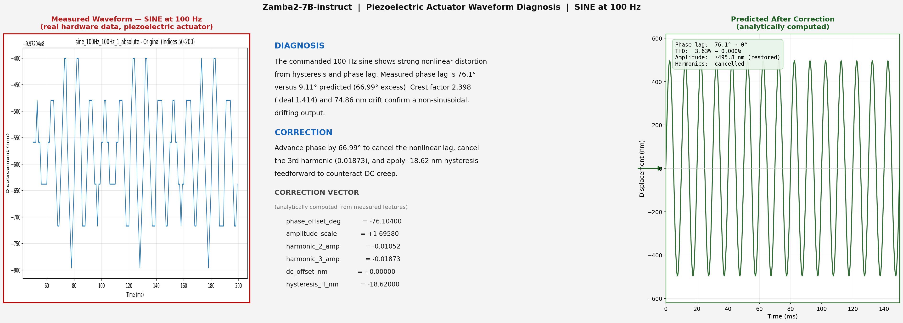
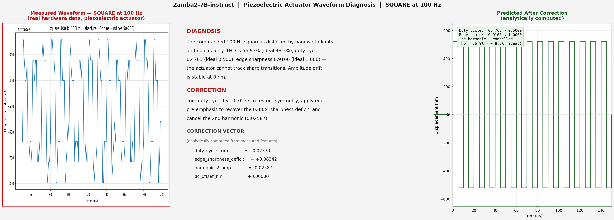

# mamba_zamba

Diagnostic report generation for piezoelectric actuators using
**Zamba2-7B-instruct** (Mamba-2 + Transformer hybrid, 7B parameters).

Given waveform measurement data, the system produces three outputs:

- **DIAGNOSIS** — identifies what is wrong with the waveform and why
- **CORRECTION** — describes the control strategy to fix it
- **CORRECTION VECTOR** — exact numerical parameters for the Moku PID
  controller, computed analytically (100% accurate)

The DIAGNOSIS and CORRECTION text are generated by the LLM. The CORRECTION
VECTOR is computed from closed-form formulas, so it is always correct
regardless of the LLM output quality.

---

## How it works

The model receives one real training example as context (1-shot), then
generates the report for a new waveform. No gradient updates are performed.

```
[Training example as context]
Input:  measured waveform features (THD, phase lag, harmonics, RMS...)
Output: DIAGNOSIS + CORRECTION

[New test sample]
Input:  measured waveform features
Output: DIAGNOSIS + CORRECTION  <-- generated by Zamba2-7B
        CORRECTION VECTOR       <-- computed from formulas (100% accurate)
```

---

## Why the model is not fine-tuned (yet)

The current results use **few-shot prompting**, not fine-tuning. This was a
deliberate staging choice, not an oversight:

1. **Getting Zamba2 to run was the first hurdle.** Zamba2-7B-instruct has a
   weight-tying bug that raises a `ValueError` and leaves tied layers randomly
   initialized under newer `transformers` versions. Substantial effort went
   into a monkey-patch plus a manual object-sharing fix (`fix_zamba2_tying`)
   before the model produced coherent output at all. See `infer_zamba.py`.

2. **The CORRECTION VECTOR does not need the LLM.** The numerical control
   parameters — the part that actually drives the Moku PID loop — are computed
   analytically. Few-shot text is already good enough to demonstrate the
   pipeline end to end.

3. **Fine-tuning is the planned next step.** A LoRA fine-tuning pipeline is
   included (`finetune_zamba.py`, `run_finetune.sbatch`). Fine-tuning is
   expected to improve format consistency, domain vocabulary, and numerical
   grounding of the generated text. It will **not** change the CORRECTION
   VECTOR, which is already exact.

**What fine-tuning will and will not change:**

| Aspect | Few-shot (current) | After fine-tuning (expected) |
|--------|--------------------|------------------------------|
| CORRECTION VECTOR accuracy | 100% | 100% (unchanged — analytic) |
| Text format consistency | good | better |
| Domain vocabulary | general | piezo-specific |
| Number grounding in text | occasional drift | tighter |

---

## Complete Pipeline

```
Step 1  Raw hardware data (CSV files from piezo actuator)
           |
           v  process_raw_8.py  (signal processing, FFT, quarter analysis)
Step 2  features_full.csv  (493 samples x 57 features)
           |
           +--> build_feature_text()        --> formatted text input
           |
           +--> compute_correction_vector() --> CORRECTION VECTOR (math formulas)
           |
           +--> PNG waveform image + feature text --> Gemini Vision API
           |                                          --> DIAGNOSIS + CORRECTION text
           v
Step 3  training_data.csv  (input text + generated description + CV)
           |
           v  prepare_data.py
Step 4  train.jsonl (1468)  val.jsonl (490)  test.jsonl (487)
           |
           v  infer_zamba.py / finetune_zamba.py
Step 5  Zamba2-7B-instruct generates DIAGNOSIS + CORRECTION
        CORRECTION VECTOR appended analytically (100% accurate)
```

**Note on training labels:** the DIAGNOSIS and CORRECTION text in the training
data were generated by **Gemini Vision API** (gemini-2.5-flash), which received
both the waveform PNG and the extracted feature text. Zamba2 is trained (or
prompted) to reproduce this format and quality. This is documented so the paper
can state the label source precisely.

---

## Input Features

Each sample fed to Zamba2 is a formatted text block built from
`features_full.csv`. The raw CSV columns are extracted from hardware
measurements using FFT, quarter-window analysis, and signal fitting.

### What the model receives (example — sine at 100 Hz)

```
COMMANDED WAVEFORM: sine at 100.0 Hz, target peak +/-495.8 nm

IDEAL REFERENCE for this waveform type:
  THD: 0%
  sine-fit residual: 0%
  crest factor: 1.414
  even harmonics: 0
  FOPDT predicted phase lag: 9.11 deg (any excess is nonlinear distortion)
  FOPDT predicted attenuation: 0.9879

MEASURED FEATURES (480-740 ms window):
  Dominant frequency (Hz): 100.0
  RMS displacement (nm):   206.7
  Peak displacement (nm):  495.8
  THD (%):                 3.631
  Crest factor:            2.398
  2nd harmonic ratio:      0.01052
  3rd harmonic ratio:      0.01873
  Phase lag (deg):         76.1
  Amplitude drift Q1->Q4 (nm): 74.86
  Hysteresis (nm):         18.62
  ...
```

### Feature definitions

| Feature | Source | Physical meaning |
|---------|--------|-----------------|
| `dominant_freq_hz` | FFT peak | Actual output frequency |
| `rms_nm` | Time-domain RMS | Overall signal energy |
| `peak_nm` | Time-domain max | Maximum displacement achieved |
| `thd_pct` | FFT harmonics | Total Harmonic Distortion — how far from ideal |
| `crest_factor` | peak/RMS | Shape factor (ideal sine 1.414, ideal square 1.0) |
| `harmonic_ratio_2` | H2/H1 amplitude | 2nd harmonic contamination |
| `harmonic_ratio_3` | H3/H1 amplitude | 3rd harmonic contamination |
| `sine_phase_lag_deg` | sine fit | Phase lag between commanded and measured |
| `fopdt_phase_lag_deg` | linear model | Phase lag predicted by linear FOPDT model |
| `amplitude_drift_nm` | Q4 peak − Q1 peak | Temporal creep/drift over the window |
| `hysteresis_nm` | half-cycle asymmetry | Piezo hysteresis width |
| `square_duty_cycle` | zero-crossing ratio | Fraction of period above zero |
| `square_edge_sharpness` | 10%–90% rise time | Transition sharpness (1.0 = ideal) |
| `ramp_rise_linearity` | linear fit R² | Rising-ramp linearity (1.0 = ideal) |
| `spectral_flatness` | geo/arith mean | Noise-spectrum flatness (1.0 = white noise) |

**FOPDT** = First Order Plus Dead Time, the standard linear model for piezo
actuators. Any phase lag or attenuation beyond the FOPDT prediction is pure
nonlinear distortion.

---

## Correction Vector Formulas

The CORRECTION VECTOR is **not generated by the LLM**. It is computed from the
measured features using closed-form formulas, which is why it is 100% accurate.
Source: `../mamba_llm/generate_training_data.py`.

### Sine

| Field | Formula | Meaning |
|-------|---------|---------|
| `phase_offset_deg` | `−phase_lag` | Negate measured lag to cancel it |
| `amplitude_scale` | `(peak / √2) / RMS` | Ideal-to-measured RMS ratio (sine: RMS = peak/√2) |
| `harmonic_2_amp` | `−h2_ratio` | Feedforward cancellation of 2nd harmonic |
| `harmonic_3_amp` | `−h3_ratio` | Feedforward cancellation of 3rd harmonic |
| `dc_offset_nm` | `−mean(Q1..Q4 mean)` | Negate average DC drift |
| `hysteresis_ff_nm` | `−hysteresis_nm` | Feedforward pre-distortion for hysteresis |

Example (sine at 100 Hz):
```
phase_lag = 76.1        -> phase_offset_deg = -76.1
peak/√2 = 495.8/1.414 = 350.5 nm ; RMS = 206.7 nm
                        -> amplitude_scale = 350.5/206.7 = +1.6958
h2 = 0.01052            -> harmonic_2_amp = -0.01052
h3 = 0.01873            -> harmonic_3_amp = -0.01873
hysteresis = 18.62 nm   -> hysteresis_ff_nm = -18.62
```

### Square

| Field | Formula | Meaning |
|-------|---------|---------|
| `duty_cycle_trim` | `0.5 − duty_cycle` | Difference from ideal 50% duty |
| `edge_sharpness_deficit` | `1.0 − edge_sharpness` | Deficit from ideal sharp edge |
| `harmonic_2_amp` | `−h2_ratio` | Cancel even harmonics |
| `dc_offset_nm` | `−mean(Q1..Q4 mean)` | Negate DC drift |

### Ramp

| Field | Formula | Meaning |
|-------|---------|---------|
| `rise_linearity_correction` | `1.0 − rise_linearity` | Rising-ramp linearity deficit |
| `fall_linearity_correction` | `1.0 − fall_linearity` | Falling-ramp linearity deficit |
| `asymmetry_correction` | `−rise_fall_asymmetry` | Negate rise/fall timing asymmetry |
| `amplitude_scale` | `(peak / √3) / RMS` | Ideal sawtooth: RMS = peak/√3 |
| `dc_offset_nm` | `−mean(Q1..Q4 mean)` | Negate DC drift |

### Pulse

| Field | Formula | Meaning |
|-------|---------|---------|
| `ringing_suppression_target` | `pulse_ringing_ratio` | Ringing level to suppress |
| `pulse_duty_cycle_measured` | `pulse_duty_cycle` | Measured on-time fraction |
| `amplitude_scale` | `peak / RMS` | Pulse amplitude compensation |
| `dc_offset_nm` | `−mean(Q1..Q4 mean)` | Negate DC drift |

### Noise

| Field | Formula | Meaning |
|-------|---------|---------|
| `whitening_required` | `1.0 − spectral_flatness` | Spectral shaping needed (0 = white) |
| `rms_measured_nm` | `RMS` | Measured RMS for amplitude matching |
| `gaussianity_error` | `noise_gaussianity_err` | Deviation from Gaussian |
| `autocorr_lag1` | `noise_autocorr_lag1` | Temporal correlation at lag 1 |

---

## Example: Sine at 100 Hz

Left: real hardware measurement. Center: LLM diagnostic report. Right:
predicted corrected waveform after applying the CORRECTION VECTOR.



## Example: Square at 100 Hz



The left panels are actual measurement images from the piezo actuator hardware.
The right panels are the analytically predicted output after correction — a
future step will replace them with real re-measured waveforms once the Moku PID
loop runs the correction in hardware.

---

## Inference Results (487 test samples)

| Waveform | Samples | Inference Speed |
|----------|---------|-----------------|
| sine     | 120     | 11.7 tok/s      |
| square   | 120     | 11.7 tok/s      |
| ramp     | 80      | 11.8 tok/s      |
| pulse    | 75      | 11.8 tok/s      |
| noise    | 92      | 11.7 tok/s      |
| **Total**| **487** | **11.7 tok/s**  |

- Average time per sample: ~22 seconds on NVIDIA A100 80GB
- CORRECTION VECTOR accuracy: 100% (analytically computed)

---

## CORRECTION VECTOR fields by waveform type

| Waveform | Fields |
|----------|--------|
| sine | phase_offset_deg, amplitude_scale, harmonic_2_amp, harmonic_3_amp, dc_offset_nm, hysteresis_ff_nm |
| square | duty_cycle_trim, edge_sharpness_deficit, harmonic_2_amp, dc_offset_nm |
| ramp | rise_linearity_correction, fall_linearity_correction, asymmetry_correction, amplitude_scale, dc_offset_nm |
| pulse | ringing_suppression_target, pulse_duty_cycle_measured, amplitude_scale, dc_offset_nm |
| noise | whitening_required, rms_measured_nm, gaussianity_error, autocorr_lag1 |

---

## Model

| Property | Value |
|----------|-------|
| Model | Zyphra/Zamba2-7B-instruct |
| Architecture | Mamba-2 + Transformer hybrid |
| Parameters | 7B |
| Method (current) | 1-shot few-shot (no fine-tuning) |
| Method (planned) | LoRA fine-tuning (`finetune_zamba.py`) |
| Precision | bfloat16 |
| Hardware | NVIDIA A100 80GB |

---

## Data Files

| File | Description |
|------|-------------|
| `../data/` | Raw CSV files from piezo actuator hardware |
| `../mamba_llm/features_full.csv` | 493 samples x 57 extracted features |
| `../mamba_llm/training_data.csv` | Generated training data (features + text + CV) |
| `../mamba_llm/data/train.jsonl` | 1468 training samples |
| `../mamba_llm/data/val.jsonl` | 490 validation samples |
| `../mamba_llm/data/test.jsonl` | 487 test samples |
| `results/eval_results.jsonl` | Zamba2 inference results (generated on cluster) |

## Scripts

| File | Description |
|------|-------------|
| `../mamba_llm/generate_training_data.py` | Extract features + Gemini text + compute CV |
| `../mamba_llm/prepare_data.py` | Split training_data.csv into train/val/test JSONL |
| `infer_zamba.py` | Few-shot inference (5 test samples) |
| `finetune_zamba.py` | LoRA fine-tuning on train.jsonl |
| `infer_finetuned.py` | Inference using the fine-tuned LoRA adapter |
| `eval_zamba.py` | Full evaluation on 487 test samples |
| `make_figures.py` | Generate the README example figures locally |
| `visualize_results.py` | Generate figures from eval results |
| `run_zamba.sbatch` | SLURM job for inference |
| `run_finetune.sbatch` | SLURM job for fine-tuning |
| `run_eval.sbatch` | SLURM job for full evaluation |

---

## Usage

```bash
# Few-shot inference on 5 samples
sbatch run_zamba.sbatch

# LoRA fine-tuning (planned next step)
sbatch run_finetune.sbatch

# Full evaluation (487 samples, ~3 hours on A100)
sbatch run_eval.sbatch

# Regenerate the README example figures
python make_figures.py
```
